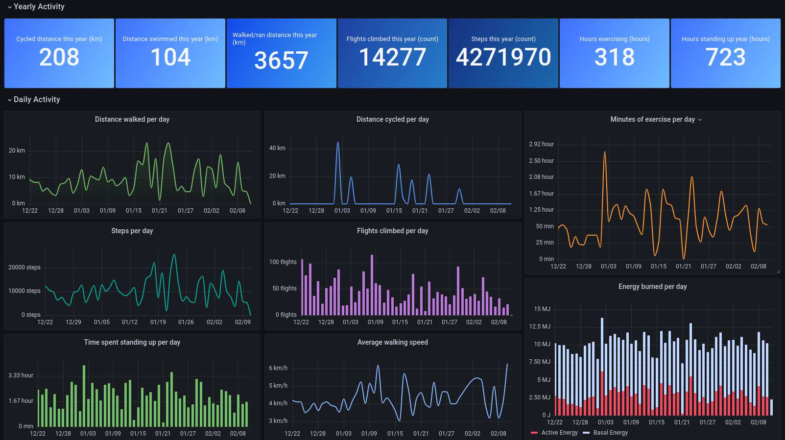
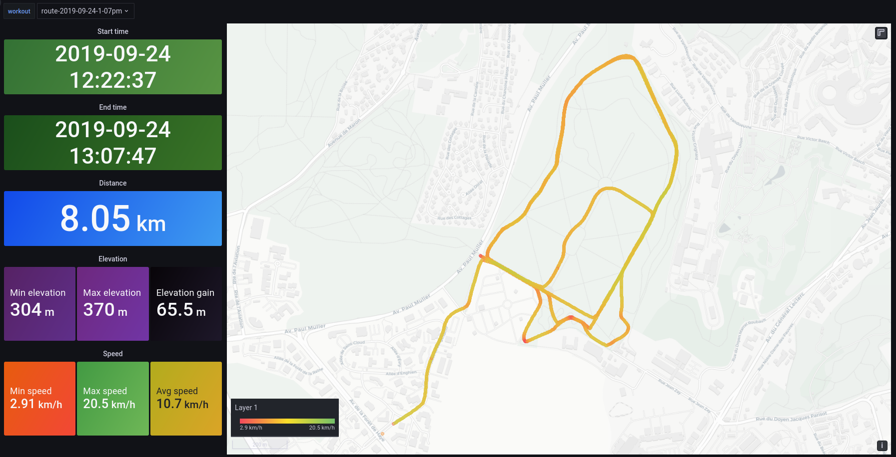
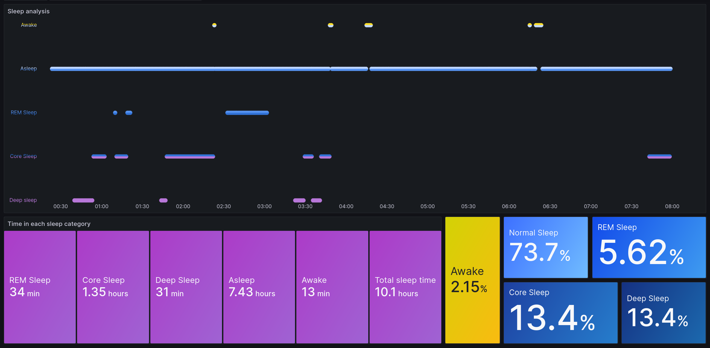

# Apple Health Grafana

将苹果健康数据导入 InfluxDB 并通过 Grafana 可视化，支持 **一键部署** 和 iOS App **Health Auto Export** 实时数据推送。

- ### 综合健康/运动/活动仪表板
  
- ### 运动路线地图
  
- ### 睡眠追踪
  

---

## 一键部署（推荐）

服务器上只需安装 Docker，一条命令即可完成全部部署：

```bash
curl -fsSL https://raw.githubusercontent.com/k0rventen/apple-health-grafana/main/deploy.sh | bash
```

或者手动执行：

```bash
git clone https://github.com/k0rventen/apple-health-grafana.git
cd apple-health-grafana
cp .env.example .env   # 按需修改配置
docker compose up -d --build
```

部署完成后：
- **Grafana 仪表板**：`http://<服务器IP>:3000`（默认账号 `admin` / `health`）
- **Health Auto Export API**：`http://<服务器IP>:5353/api/healthautoexport`

### 环境变量

复制 `.env.example` 为 `.env` 即可自定义配置：

| 变量 | 默认值 | 说明 |
|------|--------|------|
| `GRAFANA_ADMIN_USER` | `admin` | Grafana 管理员用户名 |
| `GRAFANA_ADMIN_PASSWORD` | `health` | Grafana 管理员密码 |
| `GRAFANA_PORT` | `3000` | Grafana 映射端口 |
| `GRAFANA_ROOT_URL` | `http://localhost:3000` | Grafana 对外访问地址，用于生成公开看板链接 |
| `INFLUX_DB` | `health` | InfluxDB 数据库名 |
| `API_PORT` | `5353` | Health Auto Export API 端口 |
| `API_KEY` | _(空)_ | API 鉴权密钥，设置后客户端需带 `X-API-Key` 请求头 |

---

## Health Auto Export 配置指南

[Health Auto Export](https://apps.apple.com/app/health-auto-export-json-csv/id1115567461) 是一款 iOS App，可将 Apple Health 数据自动推送到 REST API。

1. 打开 App → **自动化** → **添加自动化** → **REST API**
2. **URL** 填写：`http://<服务器IP>:5353/api/healthautoexport`
3. 导出格式选择 **JSON**
4. 如果设置了 `API_KEY`，在 **Headers** 中添加：`X-API-Key: 你的密钥`
5. 选择要同步的数据类型（Health Metrics / Workouts）
6. 建议勾选尽可能多的指标（步数、心率、睡眠、运动能量等）
7. 设置同步周期（如每小时/每天）
8. 保存即可

API 端点说明：
- `POST /api/healthautoexport` — 接收健康数据
- `GET /health` — 连通性检查

---

## 传统方式：手动导出 zip

如果不使用 Health Auto Export，也可以手动从 iPhone 导出健康数据 zip 文件。

### 导出步骤

参考 [Apple 官方说明](https://support.apple.com/guide/iphone/share-your-health-data-iph5ede58c3d/ios)：

1. 打开「健康」App → 点击右上角头像
2. 点击「导出所有健康数据」
3. 通过 AirDrop、邮件等方式传输到电脑

### 导入数据

```bash
# 编辑 docker-compose.yml，将 export.zip 路径添加到 ingester 服务
# 或直接运行：
docker compose run --rm -v /path/to/export.zip:/export.zip ingester
```

默认情况下，zip 导入会追加写入数据，不会清空已有 InfluxDB 数据。若确实要重建数据库，可显式加上：

```bash
docker compose run --rm -e RESET_INFLUX=true -v /path/to/export.zip:/export.zip ingester
```

> 注意：根据数据量不同，导入可能需要几分钟。约 200 万条数据在 i5 上约 2 分钟，树莓派 4 上约 11 分钟。

---

## 可视化

登录 Grafana 后默认有以下仪表板：
- **Health Auto Export 概览** — 推荐首页，适配 REST API 实时同步数据
- **苹果健康（全部指标）** — 所有可用指标的通用视图
- **苹果健康 · 分项指标** — 步数、心率、睡眠等常见指标的精细视图
- **运动路线** — 户外运动的 GPS 轨迹地图
- **睡眠追踪** — 各睡眠阶段时长与占比

### 数据分析提示

- 将时间间隔调整为 `1d` 以按天聚合指标
- 使用 `sum()` 替代 `mean()` 来聚合某些指标（如步数）

---

## 常用管理命令

```bash
cd ~/apple-health-grafana

docker compose logs -f          # 查看日志
docker compose restart          # 重启服务
docker compose down             # 停止服务
docker compose up -d --build    # 重新构建并启动
```

---

## 开发

使用开发配置文件构建本地镜像：

```bash
docker compose -f docker-compose-dev.yml up -d influx
docker compose -f docker-compose-dev.yml up --build -d grafana
docker compose -f docker-compose-dev.yml up --build ingester
docker compose -f docker-compose-dev.yml up --build -d api
```
